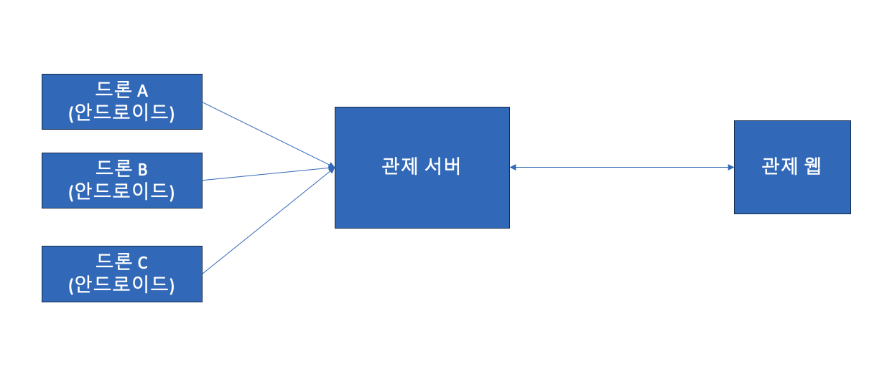

# Drone-MonitoringApp(결과물 리팩토링 깃)

- https://main--droneapp.netlify.app/ - 드론 앱
- https://main--droneapp.netlify.app/simul - 드론 시뮬레이터

요구사항

1. 드론은 여러 대가 접속할 수 있고 해당 드론마다 색깔을 달리하여 표시해야 합니다.
2. 드론의 상태 창을 클릭하면 해당 드론의 위치로 맵이 이동해야 합니다.
3. 드론의 실시간 경로를 표시해 주어야 합니다.
4. 드론의 미션 경로(날고자 하는 경로)를 표시해 주어야 합니다.
5. 현재 있는 드론의 날씨를 표시해 주어야 합니다.
6. 카메라가 달린 드론은 해당 드론의 영상을 볼 수 있습니다.
7. 비행 금지 구역을 표시해야 합니다.

## 사용한 라이브러리

- React
- emotion(styled-component)
- axios
- eslint, prettier
- OpenLayer(지도)
- Socket.io
- OpenVidu(드론카메라 영상)

## 아키텍처

**실제 통신 시나리오**



**상세 시나리오**


## Socket-Server(테스트서버) - 개발을 위한 테스트 서버ㄴ

- Deploy: Render(https://droneserver.onrender.com)
- Socket: Socket.io
- Server: Nodejs - express

### 시나리오

실제 드론이랑 테스트하며 개발할 수 없으므로 통신 시나리오를 바탕으로 소켓서버를 구성했습니다. - 그려진 아키텍처를 바탕으로 시뮬레이션 서버를 구현함.

**드론 통신 시나리오**

1. 드론 유저는 스마트폰을 통해 드론을 제어합니다.
2. 이때 드론에서 촬영되는 영상주소와 정보들을 스마트폰에 쏴줍니다.
3. 스마트폰에서는 해당 드론에 대해서 미션 정보를 중앙 서버로 전송할 수 있습니다.(실시간으로 전송됩니다.)
4. 또한 스마트폰에서 드론 정보를 소켓서버로 된 중앙 서버로 데이터를 전송합니다.(소켓으로 연결되 실시간으로 전송됩니다.)
5. 중앙서버는 그것을 모니터링 앱으로 전송해줍니다.

**소켓통신 약속된 명령어**

- 'message' : 실시간 데이터
- 'mission' : 미션 정보

### 테스트환경 시나리오

1. 모니터링 웹서버의 연결을 감지합니다.(소켓 연결 생성)

```js
const socketInit = (server, app) => {
  const io = SocketIO(server, {
    path: "/socket.io",
  });
  app.set("io", io);
  app.set("onlineMap", onlineMap);
  return io;
};
```

2. 스마트폰에서 전송되는 드론데이터를 감지합니다.(드론과의 소켓 연결 생성)

3. 미션과 드론에 대한 정보를 감지했다면 그것을 그대로 연결된 웹서버 소켓에 그대로 보내줍니다.

2-3의 코드를 구현하면 아래와 같습니다.

```js
// 3. 드론 클라이언트 연결 처리
function handleDroneClientConnection(io, webNsp) {
  // 연결될 때 이벤트를 등록합니다.
  io.of(/^\/drone-.+$/).on("connect", (socket) => {
    // 드론 연결 및 메시지 처리 로직
    initializeDroneConnection(socket);

    // 드론에 관한 정보가 담긴 메세지를 처리 -> 모니터링 앱에 보내준다.
    socket.on("message", (data) => {
      processDroneMessage(socket, data, webNsp);
    });

    // 드론이 해야할 미션 정보(경로)를 받아 모니터링 앱에 보내준다.
    socket.on("mission", (data) => {
      updateDroneMission(socket, data, webNsp);
    });

    socket.on("disconnect", () => {
      delete onlineMap[socket.nsp.name];
    });
  });
}
```

## Drone-Monitoring App

### 구현환경

next-js로 구현된 것을 아래의 버전으로 마이그레이션을 진행했습니다.

- Typescript : 소켓데이터를 주고받기 때문에 컴파일과정을 통해 객체타입을 명확하게 유지시키기 위한 목적으로 추가했습니다.
- React App: next의 기능을 사용하지 않기 때문에 Webpack과 babel을 설정해 React로 앱을 다시 구성했습니다.

### 리팩토링시 다시 살펴본 것

- 스타일코드
- 함수 분리
- 폴더 구조

### 스타일 코드

아래의 컨벤션 규칙을 적용했습니다.

- 컴포넌트의 이름은 반드시 대문자로 시작
- 1개의 요소를 감싸는 컴포넌트는 Wrapper로 끝내기
- 여러개 요소를 감싸는 컴포넌트는 Container로 끝내기
- 최상위 레이아웃 컴포넌트는 Layout으로 끝내기
- div태그(Box) 컴포넌트 이름은 Box로 끝나게 짓기
- li 태그 컴포넌트는 Item 으로 끝내기
- 모든 컴포넌트는 기능을 암시하게(예를들면 LoginBox, LoginContainer 등)로 짓기
- p,h1,h2,Typography 등 택스트와 관련된 컴포넌트는 Text로 끝내기

### 함수 분리

단일 책임원칙을 적용해 마이그레이션을 진행했습니다.

적용한 파일은 Home화면의 socket데이터 부분을 분리시켯습니다.

따라서 socket의 드론메세지를 받는 부분이 아래와 같이 변경되었습니다.

```tsx
const onDroneConnect = (data: SocketDroneType) => {
  //소켓 데이터를 드론 데이터로 생성
  const newDroneData = CreateNewDroneData(data);

  //드론 찾아보기
  const droneidx = CheckNewDrone(drones, newDroneData); //idx == -1 not found

  //이미 있는 드론이라면 정보만 변경
  if (droneidx !== -1) {
    ChangeDroneData(droneidx, newDroneData, setDrones, OnDisconnectDrone);
    return;
  }
  AddDroneData(newDroneData, drones.length, OnDisconnectDrone);
  AddDroneWeatherData(newDroneData);
  AddDroneArray(newDroneData, setDrones);
};
```

위와같이 하나의 동작단위로 보일 수 있게 의도했습니다.

### 폴더 구조

여러 참고자료를 보며 아래와 같이 구조를 그렸습니다.

컴포넌트가 많지 않기 때문에 pages, modules로 컴포넌트를 구분하였습니다. modules는 UI,동작단위로 pages에서 직접 불러오는 폴더입니다.

lib은 외부 라이브러리의 설정을 크게 건들면 안되는 코드들만 가져다 놨습니다.

```
src/
  components/
    pages/
    modules/
      ...
    lib/
  assets/
  hooks/
  type/
  utils/
  App.tsx
  index.tsx
```

- components/modules: page에서 가져오는 하나의 모듈단위로 폴더를 나눴다.
- components/pages: 시뮬레이션 페이지와 메인 페이지가 있기 때문에 Page를 가져오는 컴포넌트들을 폴더로 구분했다.
- components/lib: OpenVidu, VWMap등 외부의 라이브러리를 가져와서 Component로 조립하는데, 이때 외부에서 가져온 컴포넌트는 lib폴더에 둔다.
- assets: img 폴더만 존재하고 여기에 아이콘 등을 둔다.
- hooks: 커스텀 훅을 작성한다.
- type: module타입(svg타입을 명시해줘야되더라..)과 드론,날씨 데이터 등 타입 정의를 해준다.
- utils: 불러올 상수값과 재사용되는 함수들을 utils폴더에 둔다.
- App.tsx: Route를 App.tsx에서 정의해준다.
- index.tsx: 기본 뼈대(root가져와서 App을 랜더링해주는 것)
